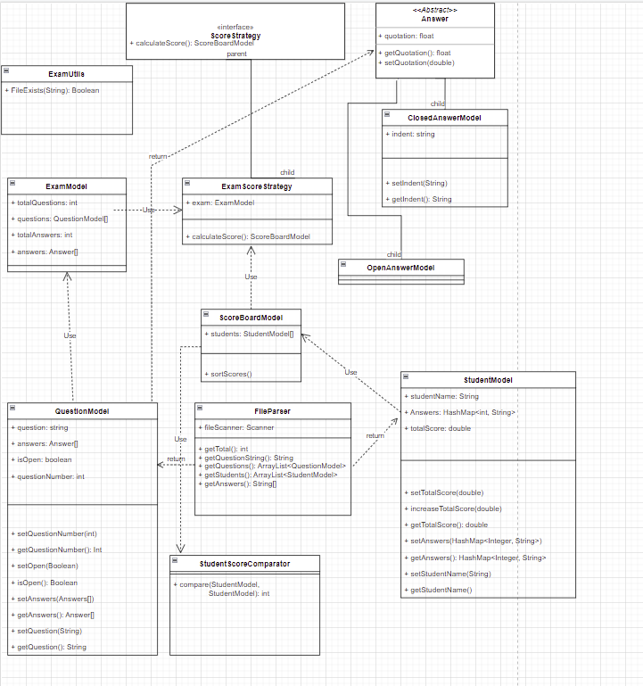

## Relatorio TP1 POO

### Descrição do problema 
O professor de matemática exausto de avaliar questões, decidiu formular os
seus testes, ao bom estilo americano, com respostas de escolha múltipla.
Depois de pensar melhor, verificou que deveria misturar questões abertas e
questões fechadas. Para automatizar a tarefa de cálculo das cotações, pediu
ajuda aos informáticos.
### Abordagem ao problema
Para a resolução a este problema começamos por identificar a estrutura do exame, apos uma analise intensiva podiamos verificar quais os passos a seguir para a leitura do ficheiro. De seguida prosseguimos a criação das devidas classes de forma a aplicarmos a business logic do professor de matemática.

### UML

### Testes Unitários
| Tests | Files | 
| ------ | ------ |
FileTest | https://github.com/filipe11402/OOP-Project/blob/main/src/Tests/FileTest.java
FileParserTests  | https://github.com/filipe11402/OOP-Project/blob/main/src/Tests/FileParserTests.java

### Conclusão
Para finalizar, este projeto, permitiu aos programadores, implementar uma nova metodologia de desenvolvimento, o TDD.
Resolvendo o problema proposto da melhor maneira possível, a nosso ver.
